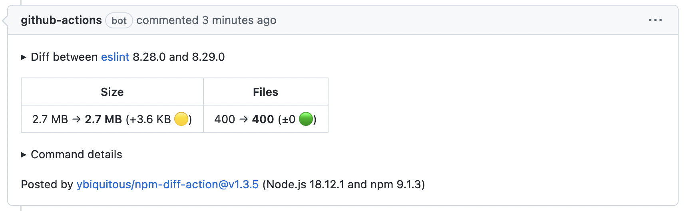

# `npm diff` Action

This action posts a PR comment including output of the [`npm diff`](https://docs.npmjs.com/cli/commands/npm-diff) command (added with npm 7.5.0).

## Usage

For an example of the usage, you can put a `.github/workflows/npm-diff.yml` file with the following content:

```yaml
name: npm diff

on:
  pull_request_target:
    types: [opened]

jobs:
  npm-diff:
    if: ${{ startsWith(github.head_ref, 'dependabot/npm_and_yarn/') }}
    runs-on: ubuntu-latest
    permissions:
      contents: read
      pull-requests: write
    steps:
      - uses: ybiquitous/npm-diff-action@v1
```

Then, the action will post a report on a PR comment when a Dependabot PR is opened.

See also an [example](https://github.com/ybiquitous/npm-diff-action/pull/202#issuecomment-1336095687).



## Input options

This action provides various input options to change the default behavior.

For details about all input options, please see [`action.yml`](action.yml).
